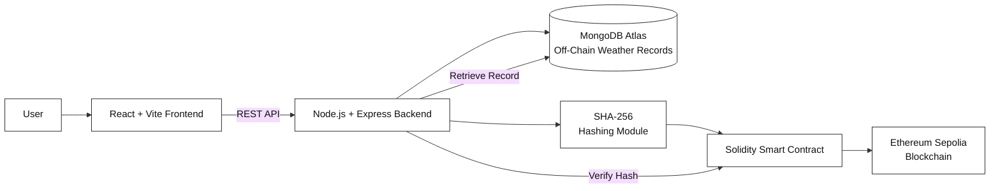
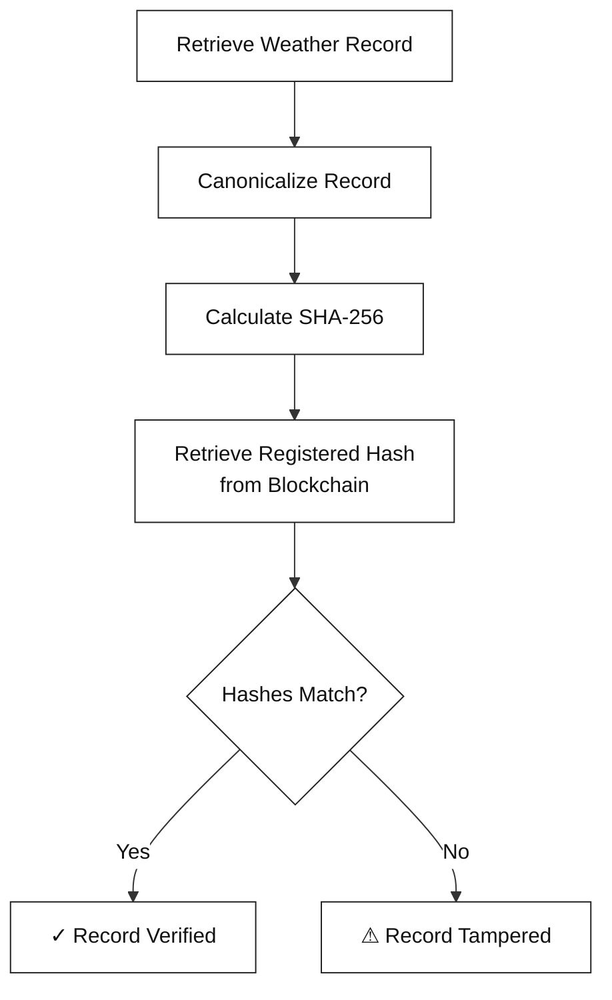
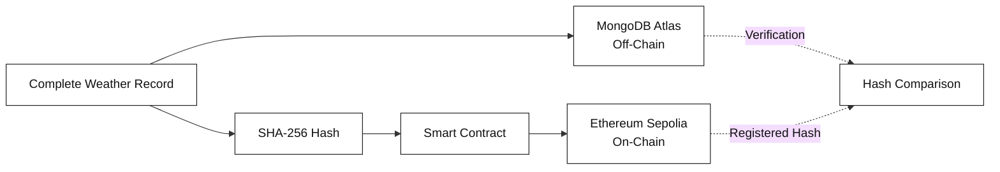

# Blockchain-Based Weather Data Integrity and Verification System

> A full-stack blockchain application for **tamper-evident storage, integrity verification, and provenance of weather observations** using a hybrid on-chain/off-chain architecture.

<p align="center">
  <a href="https://weather-integrity.vercel.app">
    <strong>🌐 Live Demo</strong>
  </a>
  &nbsp;&nbsp;•&nbsp;&nbsp;
  <a href="https://sepolia.etherscan.io/address/0x7e22eDbCA53A251C4B0F3205dd9E52Fe74726992">
    <strong>⛓️ Smart Contract</strong>
  </a>
</p>

---

## 📌 Overview

Weather observations are frequently stored and processed using conventional databases. While these systems provide efficient storage and retrieval, a database record can potentially be modified after registration without leaving an independently verifiable record of the original state.

This project addresses the **post-registration integrity and provenance** problem by combining conventional off-chain storage with blockchain-based cryptographic commitments.

The system stores the **complete weather record in MongoDB Atlas**, computes a deterministic **SHA-256 hash**, and registers that hash together with essential metadata on an **Ethereum Sepolia smart contract**.

During verification, the current MongoDB record is hashed again and compared with the immutable blockchain commitment:

```text
Current Record
      ↓
Canonicalization
      ↓
SHA-256 Hash
      ↓
Compare with Blockchain Hash
      ↓
┌─────────────────────────────┐
│ Match       → VERIFIED      │
│ No Match    → TAMPERED      │
└─────────────────────────────┘
```

The system therefore provides a practical mechanism for detecting whether a registered weather record has been modified after its blockchain commitment was created.

> **Important:** Blockchain verification establishes that the current record matches the registered commitment. It does **not** prove that the original weather measurement was scientifically correct or that the original data source was trustworthy.

---

## ✨ Key Features

- 🔐 **SHA-256 integrity hashing**
- ⛓️ **Ethereum Sepolia blockchain integration**
- 📦 **Hybrid on-chain/off-chain data architecture**
- 🗄️ **MongoDB Atlas for complete weather records**
- 📜 **Solidity smart contract for immutable commitments**
- 🔎 **Automated record verification**
- ⚠️ **Controlled tampering detection**
- 🌐 **React + Vite web interface**
- 🚀 **Node.js + Express REST API**
- 🔗 **ethers.js blockchain integration**
- 📊 **Dashboard showing verified and tampered records**
- 🔍 **Blockchain record inspection**
- ☁️ **Public deployment using Vercel + Render**

---

## 🏗️ System Architecture



### Architecture Components

| Component             | Technology        | Responsibility                                                 |
| --------------------- | ----------------- | -------------------------------------------------------------- |
| Frontend              | React + Vite      | User interface, registration, verification, tampering controls |
| Backend               | Node.js + Express | REST API, hashing, database operations, blockchain interaction |
| Database              | MongoDB Atlas     | Complete off-chain weather records                             |
| Integrity Layer       | SHA-256           | Deterministic cryptographic fingerprint                        |
| Smart Contract        | Solidity 0.8.34   | Stores and retrieves blockchain commitments                    |
| Blockchain            | Ethereum Sepolia  | Immutable integrity reference                                  |
| Blockchain Library    | ethers.js 6.x     | Backend-to-blockchain communication                            |
| Development Framework | Hardhat 3.x       | Smart contract development and deployment                      |

---

## 🔄 How It Works

### 1. Weather Record Registration

A weather record is submitted through the web application.

Example data:

```text
Station ID       : MBL001
Timestamp        : 2026-10-08T12:00:00Z
Temperature      : 27.80 °C
Relative Humidity: 68.00 %
Pressure         : 1009.40
Precipitation    : 2.60
Wind Speed       : 10.20
```

The backend stores the complete record in MongoDB Atlas.

---

### 2. Canonicalization

Before hashing, the weather record is converted into a deterministic representation.

Numeric values are normalized to two decimal places so that equivalent values produce the same representation.

Example:

```json
{
  "station_id": "MBL001",
  "timestamp": "2026-10-08T12:00:00Z",
  "temperature": "27.80",
  "relative_humidity": "68.00",
  "pressure": "1009.40",
  "precipitation": "2.60",
  "wind_speed": "10.20"
}
```

---

### 3. SHA-256 Hash Generation

The canonical representation is passed through SHA-256.

```text
Weather Record
      ↓
Canonical JSON
      ↓
SHA-256
      ↓
64-character hexadecimal hash
```

The resulting digest acts as the cryptographic fingerprint of the registered record.

---

### 4. Blockchain Registration

The backend sends the hash and essential metadata to the deployed Solidity smart contract.

The blockchain stores:

- Record ID
- Station ID
- Timestamp
- SHA-256 hash
- Registrant address

The complete weather record is **not** stored on-chain.

---

### 5. Verification

When a user requests verification:

1. The current record is retrieved from MongoDB.
2. The same canonicalization procedure is applied.
3. SHA-256 is calculated again.
4. The original registered hash is retrieved from the blockchain.
5. Both hashes are compared.



---

## 🧪 Tampering Demonstration

The project includes a controlled tampering experiment to demonstrate the integrity mechanism.

A registered temperature value was changed in MongoDB:

| Condition                  | Temperature | Verification |
| -------------------------- | ----------: | ------------ |
| Original registered record |     27.8 °C | ✅ Verified  |
| Modified off-chain record  |     38.5 °C | ❌ Tampered  |

The blockchain commitment remains unchanged because the blockchain record is immutable.

Changing even one value produces a different SHA-256 digest:

```text
Registered Hash
63e14b382420b472d518a4c662fee6e302ea92a0497d771598200b689f8b7b52

Computed Hash After Modification
34ca223957efc22fe0f567365e6306dc162902a2401f9925a2292433f9937406
```

Since:

```text
Registered Hash ≠ Computed Hash
```

the application reports that the record has been modified.

---

## ⛓️ Smart Contract

The project uses a Solidity smart contract named:

```text
WeatherDataIntegrity
```

### Contract Structure

Each registered record contains:

```solidity
struct WeatherRecord {
    string recordId;
    string stationId;
    uint256 timestamp;
    bytes32 dataHash;
    address registrant;
}
```

### Main Functions

| Function           | Purpose                                    |
| ------------------ | ------------------------------------------ |
| `registerRecord()` | Registers a weather record commitment      |
| `getRecord()`      | Retrieves the registered blockchain record |

### Events

The contract emits:

```solidity
RecordRegistered
```

when a weather record is registered.

### Deployed Contract

**Network:** Ethereum Sepolia  
**Chain ID:** `11155111`

**Contract Address:**

```text
0x7e22eDbCA53A251C4B0F3205dd9E52Fe74726992
```

[View Contract on Sepolia Etherscan](https://sepolia.etherscan.io/address/0x7e22eDbCA53A251C4B0F3205dd9E52Fe74726992)

---

## 🗄️ On-Chain vs Off-Chain Storage

A deliberate separation is used between blockchain storage and conventional database storage.

| Storage Layer | Data                              | Purpose                         |
| ------------- | --------------------------------- | ------------------------------- |
| MongoDB Atlas | Complete weather record           | Efficient storage and retrieval |
| Blockchain    | SHA-256 hash + essential metadata | Immutable integrity reference   |

This design avoids storing complete weather datasets directly on the blockchain while retaining an independently verifiable commitment to the registered record.



---

## 🌐 Live Deployment

### Frontend

**Live Application:**

https://weather-integrity.vercel.app

The frontend is deployed using **Vercel**.

### Backend

**REST API:**

https://blockchain-weather-integrity.onrender.com

The backend is deployed using **Render**.

### Blockchain

**Network:** Ethereum Sepolia

**Smart Contract:**

https://sepolia.etherscan.io/address/0x7e22eDbCA53A251C4B0F3205dd9E52Fe74726992

---

## 🔌 REST API

The backend exposes REST endpoints for weather record management and integrity verification.

### System Status

```http
GET /api/status
```

Returns backend and blockchain connectivity information.

---

### Get All Weather Records

```http
GET /api/weather
```

Returns all weather records stored in MongoDB.

---

### Get a Weather Record

```http
GET /api/weather/:recordId
```

Returns a specific weather record.

Example:

```http
GET /api/weather/WX001
```

---

### Register a Weather Record

```http
POST /api/weather/register
```

Registers a weather record by:

1. Storing it in MongoDB.
2. Generating its SHA-256 hash.
3. Registering the hash and metadata on the blockchain.

Example request:

```json
{
  "record_id": "WX001",
  "station_id": "MBL001",
  "timestamp": "2026-10-08T12:00:00Z",
  "temperature": 27.8,
  "relative_humidity": 68,
  "pressure": 1009.4,
  "precipitation": 2.6,
  "wind_speed": 10.2
}
```

---

### Verify a Weather Record

```http
GET /api/weather/:recordId/verify
```

Recomputes the SHA-256 hash of the current MongoDB record and compares it with the blockchain commitment.

Example:

```http
GET /api/weather/WX001/verify
```

---

### Controlled Tampering

```http
POST /api/weather/tamper/:recordId
```

Modifies the selected weather record in MongoDB for demonstration of tamper detection.

Example:

```json
{
  "temperature": 38.5
}
```

> This endpoint is intended for controlled project demonstration and testing.

---

## 📁 Project Structure

```text
blockchain-weather-integrity/
│
├── contracts/
│   └── WeatherDataIntegrity.sol
│
├── ignition/
│   └── modules/
│       └── WeatherDataIntegrity.ts
│
├── backend/
│   ├── server.js
│   ├── blockchain.js
│   ├── hash.js
│   ├── weather.js
│   ├── package.json
│   └── .gitignore
│
├── frontend/
│   ├── src/
│   │   ├── App.jsx
│   │   ├── api.js
│   │   └── ...
│   ├── package.json
│   └── .gitignore
│
├── hardhat.config.ts
├── package.json
├── package-lock.json
├── .gitignore
└── README.md
```

---

## 🛠️ Local Development

### Prerequisites

Make sure the following are installed:

- Node.js 22+
- npm
- Git
- MongoDB Atlas account
- Sepolia RPC provider
- Sepolia test ETH

---

### 1. Clone the Repository

```bash
git clone https://github.com/AtharvaP555/blockchain-weather-integrity.git
cd blockchain-weather-integrity
```

---

### 2. Install Root Dependencies

```bash
npm install
```

---

### 3. Configure Hardhat Environment

Create a `.env` file in the project root:

```env
SEPOLIA_RPC_URL=your_sepolia_rpc_url
SEPOLIA_PRIVATE_KEY=your_wallet_private_key
```

> Never commit this file or expose the private key.

---

### 4. Compile the Smart Contract

```bash
npx hardhat build
```

---

### 5. Deploy the Smart Contract

For a new Sepolia deployment:

```bash
npx hardhat ignition deploy ./ignition/modules/WeatherDataIntegrity.ts --network sepolia
```

The resulting contract address must then be configured in the backend.

> The repository currently uses the already deployed Sepolia contract shown above.

---

## ⚙️ Backend Setup

Navigate to the backend:

```bash
cd backend
npm install
```

Create:

```text
backend/.env
```

with:

```env
RPC_URL=your_sepolia_rpc_url
PRIVATE_KEY=your_wallet_private_key
CONTRACT_ADDRESS=0x7e22eDbCA53A251C4B0F3205dd9E52Fe74726992
MONGODB_URI=your_mongodb_connection_string
```

Start the backend:

```bash
node server.js
```

The backend runs locally on:

```text
http://localhost:5000
```

---

## 💻 Frontend Setup

Navigate to the frontend:

```bash
cd frontend
npm install
```

Create:

```text
frontend/.env.local
```

For local backend development:

```env
VITE_API_URL=http://localhost:5000/api
```

Start the development server:

```bash
npm run dev
```

The Vite development server will provide the local frontend URL.

---

## 🔐 Environment Variables

The following variables are required for local development.

### Hardhat

```text
SEPOLIA_RPC_URL
SEPOLIA_PRIVATE_KEY
```

### Backend

```text
RPC_URL
PRIVATE_KEY
CONTRACT_ADDRESS
MONGODB_URI
```

### Frontend

```text
VITE_API_URL
```

### Security

Environment files containing secrets are excluded from version control.

**Never commit:**

```text
.env
.env.local
private keys
MongoDB connection strings
RPC credentials
```

---

## 🧰 Technology Stack

### Frontend

- React
- Vite
- Axios
- JavaScript

### Backend

- Node.js
- Express.js
- ethers.js
- MongoDB Node.js Driver
- CORS
- dotenv

### Blockchain

- Solidity `0.8.34`
- Ethereum Sepolia
- Hardhat
- Hardhat Ignition
- ethers.js

### Database

- MongoDB Atlas

### Cryptography

- SHA-256

### Deployment

- Vercel — Frontend
- Render — Backend
- Ethereum Sepolia — Blockchain

---

## 🔬 Integrity Verification Principle

Let:

```text
R = Current Weather Record
C(R) = Canonical Representation of R
Hregistered = Hash stored on the blockchain
```

During verification:

```text
Hcomputed = SHA-256(C(R))
```

The system then evaluates:

```text
Hcomputed == Hregistered
```

If true:

```text
Record matches the registered commitment
```

If false:

```text
Record has been modified after registration
```

This makes the blockchain act as an **integrity anchor** for the mutable off-chain record.

---

## ⚠️ Scope and Limitations

This system is specifically designed for **post-registration data integrity and provenance**.

It does not:

- Collect measurements directly from physical weather sensors.
- Predict weather conditions.
- Store complete weather datasets on-chain.
- Establish that an original weather measurement was scientifically correct.
- Prove that the original data source was trustworthy.
- Replace meteorological quality-control procedures.

For example, if an incorrect value is legitimately registered, the blockchain preserves the hash of that value. The system can later detect whether that registered value was changed, but blockchain verification alone cannot determine whether the original measurement was physically accurate.

---

## 🚀 Future Scope

Potential extensions include:

- Integration with authenticated meteorological and IoT data sources.
- Role-based registration and verification for multiple organizations.
- Support for multiple weather stations and organizations.
- Append-only correction records for historical observations.
- Deployment on permissioned EVM-compatible networks.
- Batch commitments or Merkle-tree based integrity verification for large datasets.
- Additional provenance metadata such as source identity and quality-control status.
- Integration with trusted meteorological data providers.
- Automated audit trails for weather-data processing pipelines.

---

## 🎯 Project Objectives

The project was developed to demonstrate how blockchain can be used as an integrity layer for weather observations.

The primary objectives are:

1. Store complete weather observations efficiently using conventional off-chain storage.
2. Generate deterministic cryptographic fingerprints using SHA-256.
3. Register those fingerprints on a blockchain.
4. Retrieve and verify the integrity of stored observations.
5. Demonstrate detection of post-registration modifications.
6. Provide an accessible web interface for the complete workflow.

---

## 📊 Demonstrated Workflow

The implemented system successfully demonstrates:

```text
                 ┌──────────────────┐
                 │ Weather Record   │
                 └────────┬─────────┘
                          │
                          ▼
                 ┌──────────────────┐
                 │ MongoDB Storage  │
                 └────────┬─────────┘
                          │
                          ▼
                 ┌──────────────────┐
                 │ SHA-256 Hashing  │
                 └────────┬─────────┘
                          │
                          ▼
                 ┌──────────────────┐
                 │ Smart Contract   │
                 └────────┬─────────┘
                          │
                          ▼
                 ┌──────────────────┐
                 │ Ethereum Sepolia │
                 └────────┬─────────┘
                          │
                     Verification
                          │
             ┌────────────┴────────────┐
             ▼                         ▼
      Hashes Match              Hashes Differ
             │                         │
             ▼                         ▼
        ✅ VERIFIED                ⚠ TAMPERED
```

---

## 📚 Research Context

The project is motivated by research demonstrating the use of blockchain for integrity, traceability, provenance, and tamper-evident management of IoT, environmental, and weather-related data.

The accompanying research report provides the detailed literature review, system methodology, implementation details, experimental results, and references.

---

## 👨‍💻 Author

**Atharva Puranik**

B.Tech. Information Technology  
Honours in Artificial Intelligence and Machine Learning

GitHub: [@AtharvaP555](https://github.com/AtharvaP555)

---

## 📄 License

This project is intended for academic and educational purposes.
